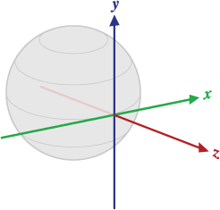
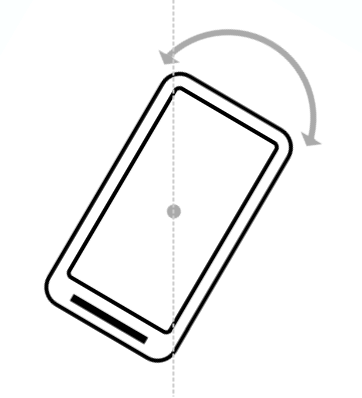
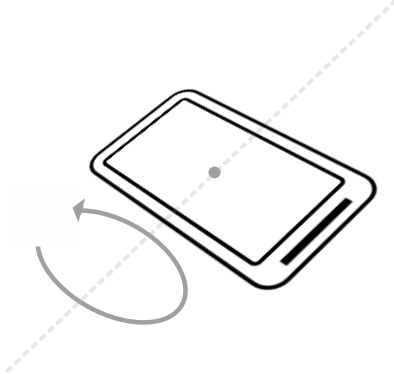
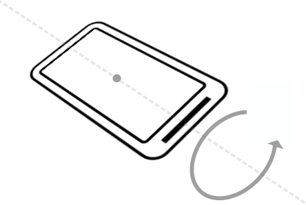

# WorldMotion
Use a CoreMotion sensor to use a coordinate system that represents device motion or position relative to the Earth. In this coordinate system:

- y points to magnetic north along the surface of the Earth.
- x is 90 degrees from y , pointing approximately east.
- z extends up into space. Negative z extends down into the ground

<p align="center">
  
</p>

[](https://travis-ci.org/ahmed.almasri@ymail.com/WorldMotion)
[](https://cocoapods.org/pods/WorldMotion)
[](https://cocoapods.org/pods/WorldMotion)
[](https://cocoapods.org/pods/WorldMotion)

## Determining device orientation

Device orientation is the position of the device in space relative to the Earth's coordinate system (specifically, to the magnetic north pole).

The `getRotationMatrix()` method generates a rotation matrix from the accelerometer and geomagnetic field sensor. A rotation matrix is a linear algebra concept that translates the sensor data from one coordinate system to another—in this case, from the device's coordinate system to the Earth's coordinate system.

The `getOrientation()` method uses the rotation matrix to compute the angles of the device's orientation. All of these angles are in radians, with values from -π to π. There are three components to orientation:

*Azimuth* : The angle between the device's current compass direction and magnetic north. If the top edge of the device faces magnetic north, the azimuth is 0.

<p align="center">
  
</p>

*Pitch* : The angle between a plane parallel to the device's screen and a plane parallel to the ground.

<p align="center">
  
</p>

*Roll* : The angle between a plane perpendicular to the device's screen and a plane perpendicular to the ground.

<p align="center">
  
</p>

>Note: orientation angles use a different coordinate system than the one used in aviation (for yaw, pitch, and roll). In the aviation system, the x -axis is along the long side of the plane, from tail to nose.

## Example

To run the example project, clone the repo, and run `pod install` from the Example directory first.

## Requirements

## Installation

WorldMotion is available through [CocoaPods](https://cocoapods.org). To install
it, simply add the following line to your Podfile:

```ruby
pod 'WorldMotion'
```

## Author

Ahmad Almasri, ahmed.almasri@ymail.com

## License

WorldMotion is available under the MIT license. See the LICENSE file for more info.
